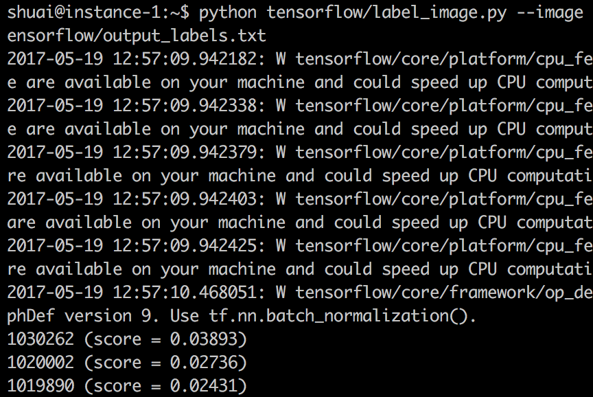

# dark-classifier
this is a face classifier which implements by aligned face with openface and retrain model with tensorflow. finally, you can use the model to classify face.

## Structure


## docker image requisites
* bamos/openface
* gcr.io/tensorflow/tensorflow:latest-devel

## Process Flow
1. collect face data
    - [one time](#how-to-collect-face-data-one-time)
    - [daily cron job](#how-to-collect-face-data-daily-cron-job)
1. [retrain model](#how-to-retrain-model)
1. [classify](#how-to-classify)

## how to collect face data (one time)
### Step 1: make a training subfolder for each person
* /face/training-images/\<xxx\>/...
* /face/training-images/\<yyy\>/...
* /face/training-images/\<zzz\>/...
* ...

### Step 2: face detection and alignment
mount face folder and run docker openface container to create a cropped and aligned version of each training-images by face landmarks

```bash
$ docker run -v /face:/face --rm bamos/openface \
/root/openface/util/align-dlib.py /face/training-images \
align outerEyesAndNose /face/aligned-images/ --size 96
```

### Step 3: check every face image count and convert png to jpeg
[WARNING: Folder has less than 20 images, which may cause issues.](https://github.com/tensorflow/tensorflow/blob/master/tensorflow/examples/image_retraining/retrain.py#L157)

---

```bash
$ python util/png_to_jpeg.py \
--dir_from /face/aligned-images \
--dir_to /face/aligned-images-jpeg
```

## how to collect face data (daily cron job)
### Step 1: run scheduler
```bash
$ python job/scheduler.py
```

apply [multiprocessing](https://github.com/Jim-Lin/dark-classifier/blob/master/job/etl.py#L164) to fetch in efficiency

### Step 2: daily face detection and alignment
mount face folder and run docker openface container

```bash
$ docker run -v /face:/face --rm bamos/openface \
/root/openface/util/align-dlib.py /face/$(date +\%Y-\%m-\%d)-training-images \
align outerEyesAndNose /face/$(date +\%Y-\%m-\%d)-aligned-images/ --size 96
```

### Step 3: move daily face data to training subfolder
```bash
$ python util/move_image.py
```

### [Step 4: check every face image count and convert png to jpeg](#step-3-check-every-face-image-count-and-convert-png-to-jpeg)

## how to retrain model
[How to Retrain Inception's Final Layer for New Categories](https://www.tensorflow.org/tutorials/image_retraining)

---

mount face folder and run docker tensorflow container and you will get the retrain model (**output_graph.pb** and **output_labels.txt**) to able to do DARK Facial Recognition

```bash
$ docker run -v /face:/face --rm gcr.io/tensorflow/tensorflow:latest-devel \
python /tensorflow/tensorflow/examples/image_retraining/retrain.py \
--image_dir /face/aligned-images-jpeg \
--output_graph /face/output_graph.pb \
--output_labels /face/output_labels.txt \
--how_many_training_steps 2000 \
--model_dir /face/inception \
--bottleneck_dir /face/bottleneck
```

### sample model
* output_graph.pb: https://storage.googleapis.com/dark-face/output_graph.pb
* output_labels.txt: https://storage.googleapis.com/dark-face/output_labels.txt

## how to classify

[use the retrained model in a Python program](https://github.com/eldor4do/TensorFlow-Examples/blob/master/retraining-example.py)

---

[install TensorFlow](https://www.tensorflow.org/install/)

on linux

```bash
$ pip install --upgrade \
https://storage.googleapis.com/tensorflow/linux/cpu/tensorflow-1.1.0-cp34-cp34m-linux_x86_64.whl
```

pass image file path with retrain model and then get the top 3 labels and scores

```bash
$ python tensorflow/label_image.py \
--image <face>.jpg \
--model /face/output_graph.pb \
--labels /face/output_labels.txt
```



## future work
* to improve classifier accuracy, need prepare a huge dataset
* to build classifier api server 
